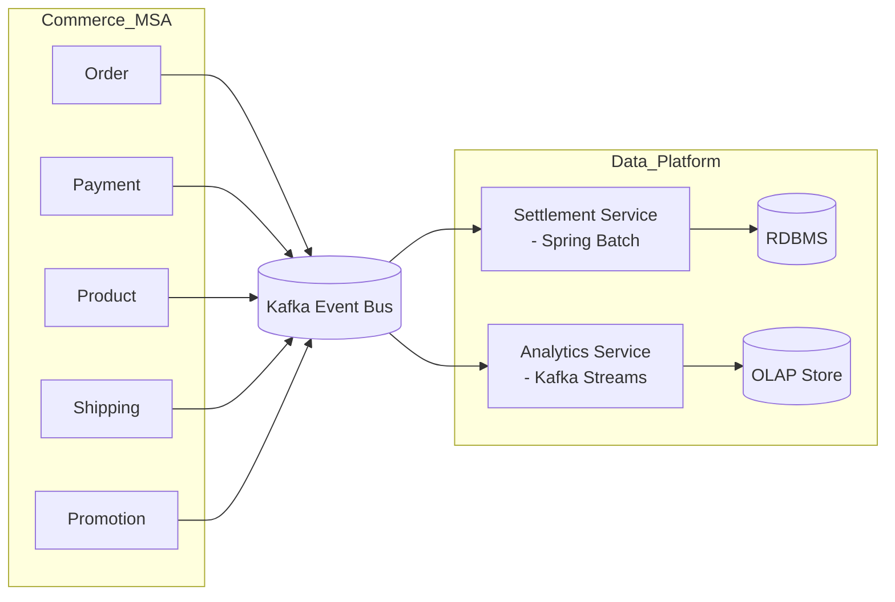
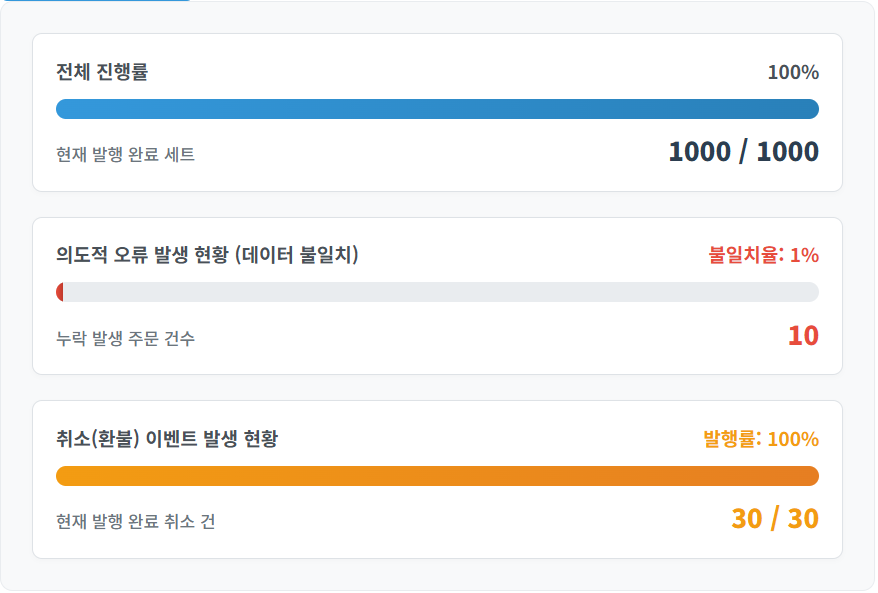
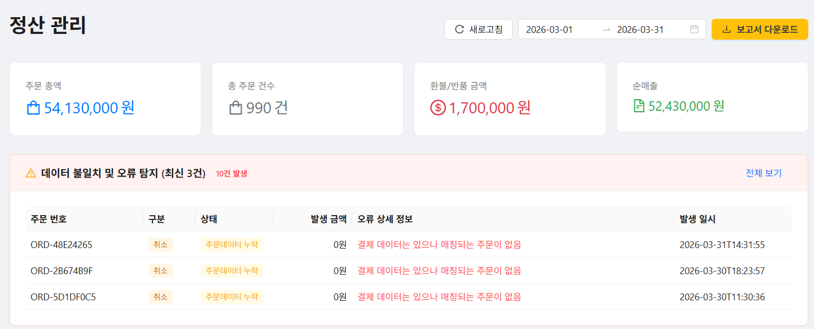

# ecommerce-data-platform
[이전 ecommerce-msa 프로젝트](https://github.com/gr1993/ecommerce-msa) 환경의 Kafka 이벤트를 기반으로 정산  (Settlement) 및 실시간 분석(Analytics) 서비스를 구현한 데이터 플랫폼 프로젝트  


## 프로젝트 개요
정산 서비스와 분석 서비스를 실제 운영 환경 관점에서 바라보면, 다음과 같은 구조로 설계된다. 



### 프로젝트 구조
본 프로젝트는 클라우드 네이티브 환경 이해도를 높이기 위해 **쿠버네티스 환경**에서 서비스와 저장소를 구성한다.  

```
[docs]
[event-bot]
    └── ecommerce-msa 환경과 유사하게 가짜 이벤트를 발생시키는 시뮬레이터
[frontend-service]
    └── 관리자 UI (정산, 대시보드 등)
[infra] 
    └── Kafka, ClickHouse 등 쿠버네티스 인프라 구성 스크립트
[settlement-service]
    └── 정산 서비스
[analytics-service]
    └── 분석 서비스
```


## 정산 서비스
정산 서비스의 핵심은 배치 처리와 데이터 대조이다. 단순 합계 계산이 아닌, 이벤트 기반 데이터 정합성을  
확보하기 위해 다음과 같은 이벤트 레코드가 필요하다.  

```
raw_order_events
- OrderCreated
- OrderCancelled

raw_payment_events
- PaymentConfirmed
- PaymentCancelled
```

### 정산 2단계 프로세스
1. Raw Event 적재 : Kafka 이벤트를 RDBMS 테이블(Raw Table)에 저장 (재처리/감사 가능, 원본 데이터 보존)
2. 배치 처리 : Reconciliation → Ledger 생성 → Settlement 집계 (하루/주 단위 집계, 오류 검증, 재처리 가능)

Raw Event 적재 단계에서는 MongoDB의 쓰기 성능과 스키마 유연성을 고려하여 이벤트를 MongoDB에 저장하려고  
했다. 하지만 RDBMS는 MongoDB보다 쓰기 속도가 느릴 수 있으나, SQL을 통한 집계와 정합성 확인이 용이하므로  
배치 기반 정산에서는 더 직관적이다. 제 현업에서도 RDB 기반의 Raw Event 테이블을 구성하는 경우가 많다.  

배치 처리 단계에서 **Reconciliation(대조)**은 raw_order 테이블과 raw_payment 테이블을 주문 번호 기준으로 교차  
검증하여 데이터 정합성을 확인하는 과정이다. 이를 통해 결제 누락이나 금액 불일치 같은 오류를 사전에 탐지할 수 있으며,  
기록된 원본 데이터를 바탕으로 재처리 및 감사 로그 관리가 용이해진다.  
진짜 정밀한 정산은 서비스 내부 데이터끼리만 맞추는 것이 아니라, 외부 PG사(Toss Payments 등)에서 제공하는 정산서  
파일과 내부 DB를 비교하는 방식으로 수행할 수 있다.하지만 이번 프로젝트에서는 내부 데이터 검증만 진행할 것이다.  

Ledger는 회계 용어로, 계정 원장을 의미하며 기업의 수입, 지출, 자산, 부채 등 모든 금융 거래를 일자별·계정별로  
정리한 핵심 장부이다. General Ledger 데이터는 필요한 단위로 집계 SQL을 실행한 이후의 데이터라고 이해하면 된다.

### 이벤트 발생 이후 정산 관리에서 배치 처리 결과 확인



이벤트 발생기를 통해 총 1,000건의 주문 및 결제 이벤트를 생성하였다. 이 중 대조 오류는 10건 발생했으며, 30건은  
취소 주문으로 처리하였다. 이후 배치 작업을 수행한 뒤 관리자에서 정산 정보를 확인한 결과, 대조 오류 10건이  
정상적으로 탐지된 것을 확인할 수 있었다. 또한 나머지 990건의 주문은 정산 처리되었으며, 취소 주문 30건을 제외한  
순매출액이 정상적으로 표시되는 것을 확인하였다.  


## 분석 서비스
분석 서비스의 핵심은 실시간 스트림 처리(Kafka Streams)와 OLAP성 쿼리이다. OLAP 쿼리를 위한 데이터  
저장소로 ClickHouse를 사용합니다.