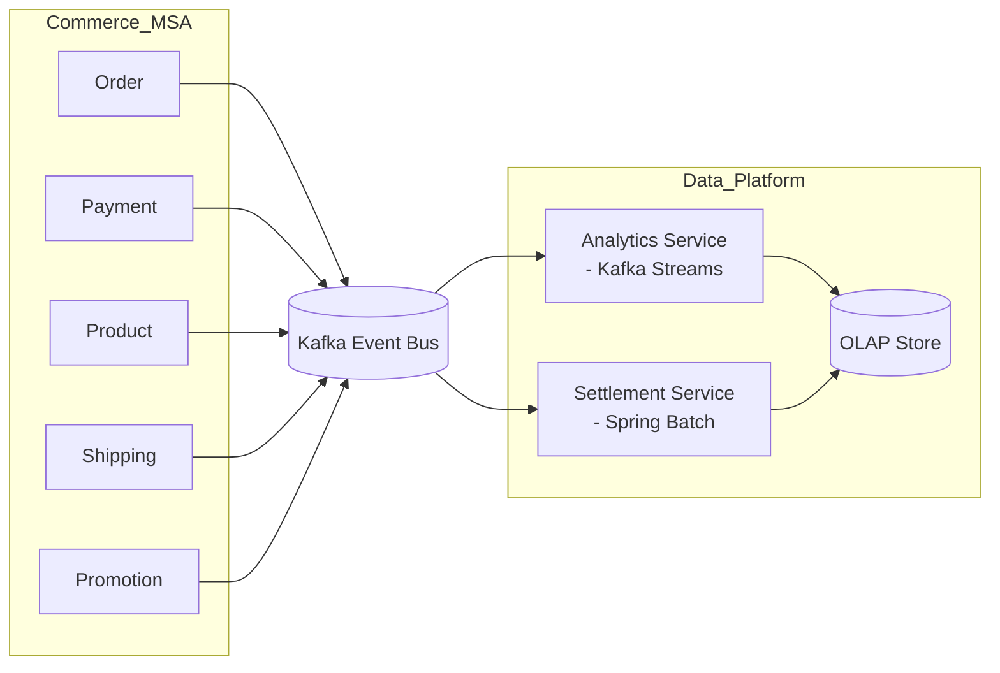

# ecommerce-data-platform
[이전 ecommerce-msa 프로젝트](https://github.com/gr1993/ecommerce-msa) 환경의 Kafka 이벤트를 기반으로 정산  (Settlement) 및 실시간 분석(Analytics) 서비스를 구현한 데이터 플랫폼 프로젝트  


## 프로젝트 개요
정산 서비스와 분석 서비스를 실제 운영 환경 관점에서 바라보면, 다음과 같은 구조로 설계된다. 



### 프로젝트 구조
본 프로젝트는 클라우드 네이티브 환경 이해도를 높이기 위해 **쿠버네티스 환경**에서 서비스와 저장소를 구성한다.  

```
[docs]
[infra] 
    └── Kafka, ClickHouse 등 쿠버네티스 인프라 구성 스크립트
[event-bot]
    └── ecommerce-msa 환경과 유사하게 가짜 이벤트를 발생시키는 시뮬레이터
[frontend-service]
    └── 관리자 UI (정산, 대시보드 등)
[settlement-service]
    └── 정산 서비스
[analytics-service]
    └── 분석 서비스
```


## 정산 서비스
정산 서비스의 핵심은 배치 처리와 데이터 대조이다. 단순 합계 계산이 아닌, 이벤트 기반 데이터 정합성을  
확보하기 위해 다음과 같은 이벤트 레코드가 필요하다.  

```
OrderCreated
PaymentConfirmed
PaymentRefunded
OrderCancelled
```


## 분석 서비스
분석 서비스의 핵심은 실시간 스트림 처리(Kafka Streams)와 OLAP성 쿼리이다. OLAP 쿼리를 위한 데이터  
저장소로 ClickHouse를 사용합니다.