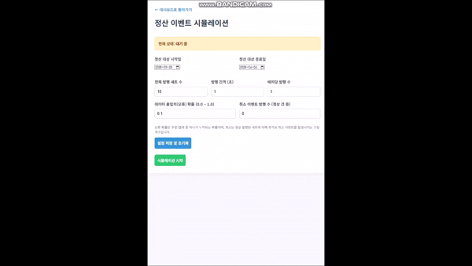
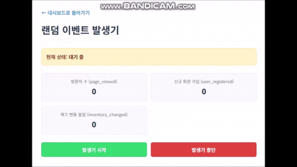
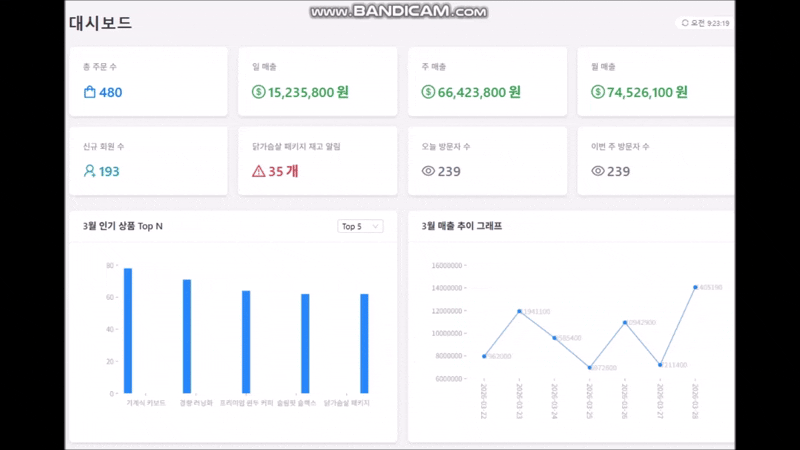
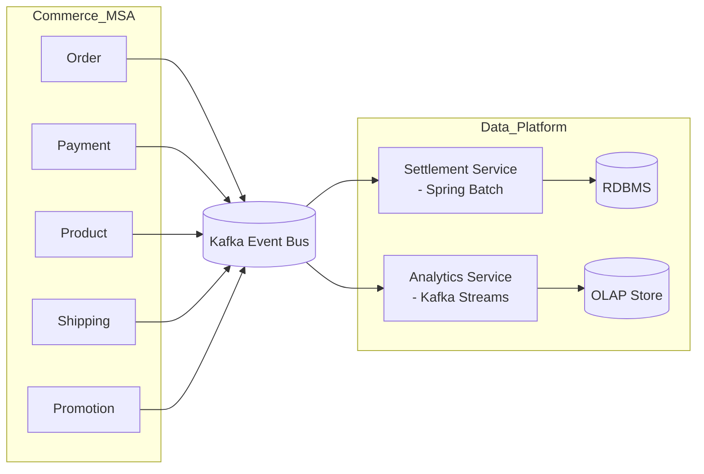
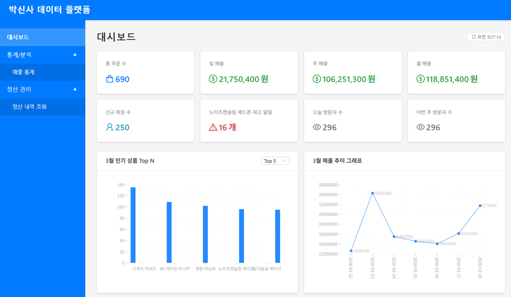
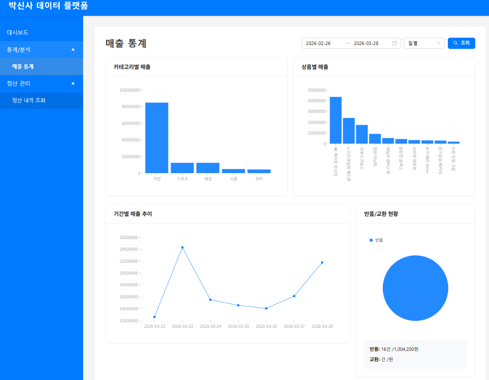

# ecommerce-data-platform
[이전 ecommerce-msa 프로젝트](https://github.com/gr1993/ecommerce-msa) 환경의 Kafka 이벤트를 기반으로 정산  (Settlement) 및 실시간 분석(Analytics) 서비스를 구현한 데이터 플랫폼 프로젝트  

### 정산 이벤트 시뮬레이션 시연


### 대시보드 이벤트 발생기 시연


### 대시보드 시연



## 프로젝트 개요
정산 서비스와 분석 서비스를 실제 운영 환경 관점에서 바라보면, 다음과 같은 구조로 설계된다. 



### 프로젝트 구조
본 프로젝트는 클라우드 네이티브 환경 이해도를 높이기 위해 **쿠버네티스 환경**에서 서비스와 저장소를 구성한다.  

```
[analytics-service]
    └── 분석 서비스
[docs]
[event-bot]
    └── ecommerce-msa 환경과 유사하게 가짜 이벤트를 발생시키는 시뮬레이터
[frontend-service]
    └── 관리자 UI (정산, 대시보드 등)
[infra] 
    └── Kafka, ClickHouse 등 쿠버네티스 인프라 구성 스크립트
[settlement-service]
    └── 정산 서비스
```


## 정산 서비스
정산 서비스의 핵심은 배치 처리와 데이터 대조이다. 단순 합계 계산이 아닌, 이벤트 기반 데이터 정합성을  
확보하기 위해 다음과 같은 이벤트 레코드가 필요하다.  

```
raw_order_events
- OrderCreated
- OrderCancelled

raw_payment_events
- PaymentConfirmed
- PaymentCancelled
```

### 정산 2단계 프로세스
1. Raw Event 적재 : Kafka 이벤트를 RDBMS 테이블(Raw Table)에 저장 (재처리/감사 가능, 원본 데이터 보존)
2. 배치 처리 : Reconciliation → Ledger 생성 → Settlement 집계 (하루/주 단위 집계, 오류 검증, 재처리 가능)

Raw Event 적재 단계에서는 MongoDB의 쓰기 성능과 스키마 유연성을 고려하여 이벤트를 MongoDB에 저장하려고  
했다. 하지만 RDBMS는 MongoDB보다 쓰기 속도가 느릴 수 있으나, SQL을 통한 집계와 정합성 확인이 용이하므로  
배치 기반 정산에서는 더 직관적이다. 현업에서도 RDB 기반의 Raw Event 테이블을 구성하는 경우가 많다.  

배치 처리 단계에서 **Reconciliation(대조)**은 raw_order 테이블과 raw_payment 테이블을 주문 번호 기준으로 교차  
검증하여 데이터 정합성을 확인하는 과정이다. 이를 통해 결제 누락이나 금액 불일치 같은 오류를 사전에 탐지할 수 있으며,  
기록된 원본 데이터를 바탕으로 재처리 및 감사 로그 관리가 용이해진다.  
진짜 정밀한 정산은 서비스 내부 데이터끼리만 맞추는 것이 아니라, 외부 PG사(Toss Payments 등)에서 제공하는 정산서  
파일과 내부 DB를 비교하는 방식으로 수행할 수 있다.하지만 이번 프로젝트에서는 내부 데이터 검증만 진행할 것이다.  

Ledger는 회계 용어로, 계정 원장을 의미하며 기업의 수입, 지출, 자산, 부채 등 모든 금융 거래를 일자별·계정별로  
정리한 핵심 장부이다. General Ledger 데이터는 필요한 단위로 집계 SQL을 실행한 이후의 데이터라고 이해하면 된다.

### 이벤트 발생 이후 정산 관리에서 배치 처리 결과 확인


이벤트 발생기를 통해 총 1,000건의 주문 및 결제 이벤트를 생성하였다. 이 중 대조 오류는 10건 발생했으며, 30건은  
취소 주문으로 처리하였다. 이후 배치 작업을 수행한 뒤 관리자에서 정산 정보를 확인한 결과, 대조 오류 10건이  
정상적으로 탐지된 것을 확인할 수 있었다. 또한 나머지 990건의 주문은 정산 처리되었으며, 취소 주문 30건을 제외한  
순매출액이 정상적으로 표시되는 것을 확인하였다.  


## 분석 서비스
분석 서비스는 사용자 활동 이벤트, 비즈니스 핵심 지표(주문, 결제), 시스템 지표 등을 수집하고, 이를  
운영팀이나 임원진이 직관적인 도표와 시각적 UI로 확인할 수 있도록 제공한다. 이를 통해 현재 비즈니스  
상황을 정확하게 파악하고 분석하여, 더 나은 의사결정을 지원하는 것을 목표로 한다.  

[이전 ecommerce-msa 프로젝트](https://github.com/gr1993/ecommerce-msa)에서는 회원가입, 주문, 결제, 재고 증감 등의 기본 이벤트를 발행하고  
있었다. 이번 실습에서는 대시보드 요구사항에 맞게 이벤트 구조를 개선하고, 방문자 수와 같이 기존에  
구현하지 않았던 이벤트도 추가로 정의하여 수집 및 처리할 예정이다.  

### 대시보드 및 매출 통계 화면




## 이번 프로젝트에서 배운점
이번 프로젝트에서 핵심적으로 활용한 기술은 ksqlDB, ClickHouse, 그리고 Kubernetes 였다. 이 데이터 분석 플랫폼을  
직접 구축하면서 ETL 처리 과정과 데이터 파이프라인 전반에 대해 더욱 깊이 이해할 수 있는 의미 있는 시간이었다.  

### Kubernetes
Kubernetes 환경은 로컬에서 Minikube를 활용해 실습했다. 해당 환경에서 Apache Kafka 클러스터를 비롯해 ksqlDB,  
Kafka UI, PostgreSQL, ClickHouse, 그리고 서비스 애플리케이션까지 다수의 컨테이너를 동시에 구동했다.  
또한 컨트롤 플레인 구성 요소까지 함께 실행되면서 전체적으로 높은 리소스 사용량이 발생했고, PC 사양의 한계로 인해  
Minikube가 멈추거나 재시작 및 재구성이 필요한 상황도 종종 발생했다.  
이처럼 추상화 수준이 높은 플랫폼은 많은 리소스를 요구하지만, 대규모 환경으로 확장할수록 자원을 효율적으로 분배하고  
로드밸런싱, 롤백, 오토스케일링과 같은 다양한 운영 기능을 제공한다는 점을 직접 경험할 수 있었다.  

### KSQL DB
ksqlDB에서 스트림을 생성하거나 INSERT INTO ... SELECT 구문을 실행할 때, SQL 구문의 가장 하단에 EMIT CHANGES를  
붙이게 된다. EMIT CHANGES는 지속적으로 쿼리를 실행하겠다는 의미로, 해당 스트림이 구독하는 토픽에서 발생하는 레코드를  
실시간으로 계속 처리한다는 것을 뜻한다. 이러한 지속 가능한 쿼리는 LIST QUERIES; 명령어를 통해 현재 실행 중인 쿼리  
목록을 확인할 수 있다.  
ksqlDB를 사용하면서 한 가지 이슈를 경험했다. 기존 토픽을 기반으로 생성된 스트림은 해당 토픽의 파티션 수(3개)와  
일치했지만, 새로운 스트림 analytics_order_item은 스트림 생성 시 파티션 옵션을 지정하지 않아 기본 1개 파티션만  
생성되었다. 이 스트림은 기존 토픽의 데이터를 구독하는 지속 가능한 쿼리로 동작했지만, 파티션 수가 달라 0번 파티션의  
데이터만 처리되는 문제가 발생했다.  
해결을 위해 analytics_order_item 스트림을 파티션 3으로 재생성하자, 기존 토픽의 모든 파티션 데이터를 정상적으로  
구독할 수 있었다. 이번 실습을 통해 **ksqlDB 스트림의 파티션 수가 곧 병렬 처리 가능한 컨슈머 수와 연결**된다는 사실을  
배울 수 있었다.  

### ClickHouse
이번 프로젝트에서는 ClickHouse를 OLAP 성격의 저장소로 활용했다. 처음에는 PostgreSQL처럼 단순히 테이블을 정의하고  
조회할 때 성능이 뛰어난 단순 조회 모델 정도로 생각했으나, 실제로는 ksqlDB처럼 내부적으로 데이터 파이프라인을 구성할  
수 있다는 점이 인상적이었다.  
ClickHouse는 PostgreSQL, Kafka, MongoDB 등 다양한 데이터 소스로부터 직접 데이터를 가져올 수 있는 엔진을  
제공하므로, 별도의 Kafka Consumer 구현이나 Kafka Connector Sink 없이도 Kafka 토픽 데이터를 ClickHouse에  
바로 저장할 수 있었다. 이후 Raw 테이블에 Kafka 토픽에서 구독한 레코드를 자연스럽게 적재하도록 파이프라인을 구성하고,  
필요한 집계 형태(대시보드용 지표 데이터)로 데이터를 관리하기 위해 **Materialized View(MV)**를 생성함으로써  
최종 가공된 형태의 데이터를 지속적으로 유지할 수 있었다.  
이처럼 테이블과 MV를 정의하고 연결하는 과정 자체가 하나의 데이터 파이프라인 구축 과정과 같다고 볼 수 있었다.  