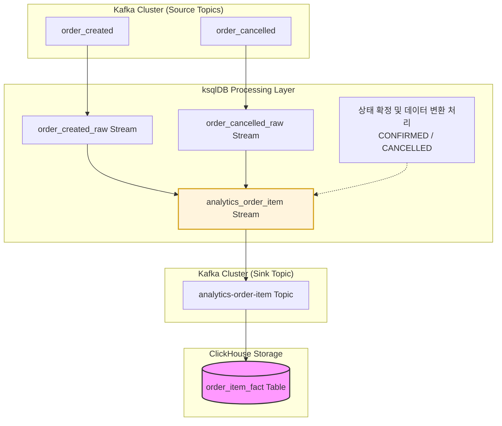
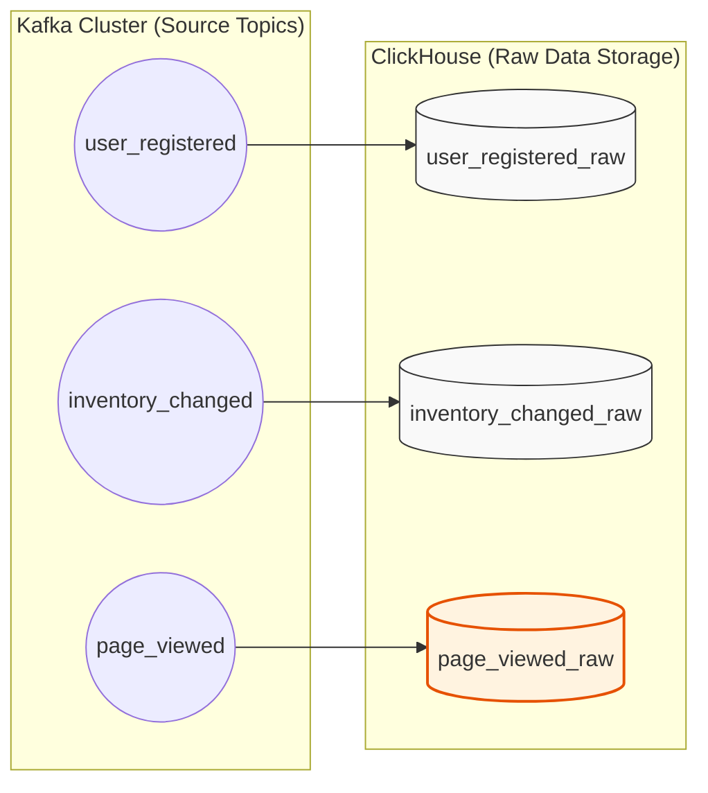

# analytics-service
분석 서비스는 다양한 이벤트 로그를 기반으로 통계 정보 및 대시보드 데이터를 제공하는 서비스이다.  
이 서비스의 핵심은 실시간 스트림 처리(Kafka Streams)와 OLAP 쿼리이며, OLAP 성격의 데이터 저장소로  
**ClickHouse를 사용**한다.  
처음에는 최근 인기 상품 TOP 10과 같은 비교적 정적인 지표를 ksqlDB의 상태 저장소(RocksDB)에 저장하고,  
조회 시 ksqlDB를 통해 직접 조회하는 방식을 고려했다. 또한 날짜 범위 조건이나 다양한 필터가 적용되는  
동적 통계 지표는 ClickHouse에 저장하여 처리하는 구조로 설계하였다.  
그러나 ksqlDB에서 고정 집계 데이터가 많아지거나 장기간의 집계 데이터를 상태 저장소에 유지할 경우,  
상태 관리 부담이 증가하고 로직 변경 시 Kafka 토픽을 재처리해야 하는 운영 비용이 발생할 수 있다.  

따라서 **ksqlDB는 데이터 정제(Cleaning), 포맷 변환(Transform), 조인(Enrichment) 등 ETL 처리에 집중**하고,  
통계 및 기간 기반 집계는 ClickHouse와 같은 OLAP 저장소에서 수행하는 구조가 일반적으로 권장된다. 이에 따라  
본 분석 서비스의 데이터 처리 파이프라인은 다음과 같이 구성하였다. 먼저 ksqlDB에서 데이터를 ETL로 가공한 뒤  
ClickHouse에 적재하고, 이후 모든 집계 및 조회는 ClickHouse에서 수행하여 API로 제공한다.  

* [ksqlDB 정리 블로그](https://little-pecorino-c28.notion.site/ksqlDB-31a82094ef0a803990e2de782a51cc5a)
* [ClickHouse 정리 블로그](https://little-pecorino-c28.notion.site/ClickHouse-32d82094ef0a805f879bfe3b97967611)

### ClickHouse
ksqlDB를 활용해 데이터를 ClickHouse에 적합한 형태로 가공한 뒤, 별도의 Kafka Connector나  
Kafka Consumer를 두지 않고 **ClickHouse의 Kafka Engine을 통해 Kafka 토픽을 직접 구독**하여  
데이터를 Insert하도록 구현할 예정이다.  
ClickHouse는 전통적인 RDBMS와 구조적 특성이 크게 다르기 때문에 스키마 설계에도 신중한 접근이  
필요하다. 일반적인 데이터 웨어하우스(DW)에서는 저장 공간 효율을 위해 사실 테이블(Fact)과 차원  
테이블(Dimension)을 분리하는 별 스키마를 주로 사용한다.  
하지만 ClickHouse는 조인보다 단일 테이블 스캔 성능이 훨씬 뛰어나기 때문에, 카테고리명, 상품명과  
같은 모든 차원 정보를 사실 테이블에 함께 포함시키는 비정규화된 Wide Table 방식이 성능을 극대화하는  
데 유리하다. 이러한 특성을 고려하여 본 시스템에서는 **Wide Table 기반으로 스키마를 설계**하였다.  

### 매출 통계

매출 통계는 [event-bot](https://github.com/gr1993/ecommerce-data-platform/tree/main/event-bot)에서 정산 서비스 개발 시 사용했던 정산 이벤트 발생기를 활용하면, 주문 데이터에  
상품 및 카테고리 정보가 함께 포함되기 때문에 별도의 이벤트 발생기 없이도 매출 통계 화면에 필요한 카테고리별  
매출, 상품별 매출, 기간별 매출 추이 등의 정보를 제공할 수 있다.  

매출 통계 데이터 ETL 과정에서는 실시간성과 데이터 무결성 간의 트레이드오프가 존재한다.  
결제 및 주문 이벤트를 즉시 ksqlDB로 처리하여 ClickHouse에 저장할 경우, 실시간으로 대시보드에  
반영되어 빠른 피드백이 가능하다는 장점이 있다. 반면, 대조 및 배치 처리가 모두 완료된 후 배치 완료  
이벤트를 기준으로 데이터를 저장하면, 정산이 완료된 주문만 반영되므로 지표의 신뢰성을 더욱 높일 수 있다.  
현재는 정산 관리 메뉴를 통해 데이터 무결성을 별도로 검증할 수 있는 지표가 이미 제공되고 있으므로,  
이번에는 **ksqlDB를 활용한 실시간 ETL 처리 방식을 선택하여 데이터를 수집**하기로 결정하였다.  

그리고 한 가지 더 고려해야 할 점은, 주문 생성과 주문 취소 상태를 ClickHouse의 order_item_fact  
테이블에서 관리하고 있다는 것이다. 이를 위해 order-created 토픽과 연결한 order_created_raw  
스트림과 order-cancelled 토픽과 연결한 order_cancelled_raw 스트림을 각각 생성했으며, 두 스트림에서  
발생하는 이벤트를 analytics_order_item 스트림으로 변환 후 집계하였다. 이후 상태를 CONFIRMED 또는  
CANCELLED로 확정한 뒤, 최종적으로 order_item_fact 테이블에 저장할 수 있도록 구조를 설계하였다.  

### 대시보드

대시보드에 표시되는 지표 중 총 주문 수, 일·주·월 매출, 인기 상품 Top N, 매출 추이 그래프는 모두  
기존 매출 통계 구축 과정에서 수집한 주문 이벤트 파이프라인의 order_item_fact 테이블만으로 충분히  
제공할 수 있다. 따라서 추가 지표인 신규 회원 수는 회원가입 이벤트를 발행하도록 event-bot에 구현하고,  
상품 재고 알림 역시 재고 증감 이벤트를 발행하도록 구성하였다. 또한 오늘 및 이번 주 방문자 수는 페이지  
조회 이벤트를 발행하도록 구현하여 수집하며, 이를 대시보드에 함께 제공하도록 설계하였다.  

### 백엔드 기술
* Spring Boot 3.5.11 (JDK 17)
* spring-boot-starter-web
* spring-boot-starter-jdbc : Spring의 표준 JDBC 추상화 및 커넥션 풀 제공
* clickhouse-jdbc : ClickHouse 통신 프로토콜을 구현한 공식 JDBC 드라이버